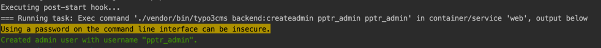
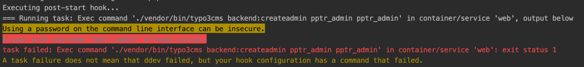

# Changed for puppeteer implementation

* Added config to `.ddev/config.yaml`
    * Added packages, puppeteer needs to run headless chrome
    * Added post-start hook that installs basic TYPO3 with user: `admin` with password `typo3.demo`
    * Added post-start hook to create puppeteer admin user: `pptr_admin` with same password
* Added `package.json` with dependency to puppeteer
* Added folder `Screenshots` to save created Images
* Added `puppeteer-testscript.js` which will collect some screenshots from the running DDEV instance

# Todo to set up puppeteer

### After running `dev start`

So far so good, but when running `ddev restart` to start over and the users already exists, there will be an exitcode 1

    Open Question: How to prevent exitcode 1, on already existing users?

work-in-progress
