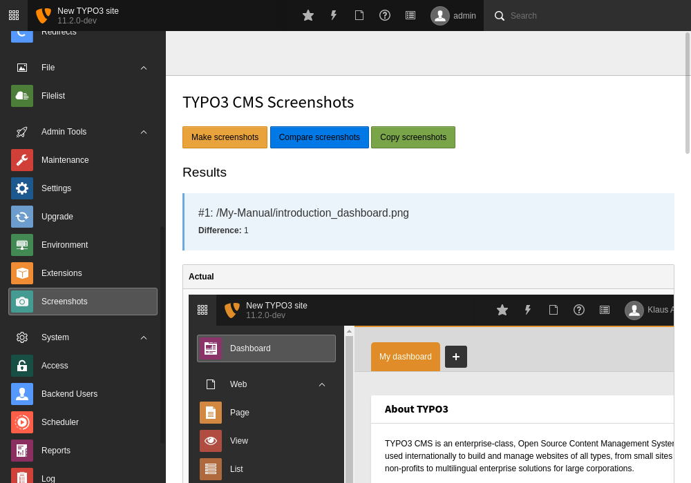

=====================
TYPO3 CMS Screenshots
=====================

This project provides a way to take screenshots of the TYPO3 CMS in a scripted way.

First, the user browses a TYPO3 instance to take notes of a click path for a new screenshot.
Next, the click path gets forged to a ``screenshots.json`` file.
Next, all ``screenshots.json`` files get executed by the screenshot runner which produces the screenshots.
Last, the actual screenshots get compared to the original screenshots and copied over if approved by the user.

Prerequisites
=============

Install

1.  `Docker <https://docs.docker.com/get-docker/>`_
2.  `Docker-Compose <https://docs.docker.com/compose/install/>`_
3.  `DDEV <https://ddev.readthedocs.io/en/stable/>`_

Browsable TYPO3 instance
========================

Installation
------------

1. Build the environment by

   .. code-block:: bash

      ddev install

2. Navigate in your browser to the website and complete the installation:

   .. code-block:: bash

      ddev launch

3. Log into the TYPO3 backend and activate the page tree of ``EXT:styleguide`` or ``EXT:introduction``:

   -  add the page tree of ``EXT:introduction`` by de- and reactivating this extension - or -
   -  add the page tree of ``EXT:styleguide`` by clicking in the upper right corner
      "(?)" -> "Styleguide" -> "TCA / Records" -> "Create styleguide page tree with data".

Re-Installation
---------------

You might want to setup the TYPO3 instance from scratch to initialize it with a distinct page tree. This can be easily
achieved by running the steps of the installation section again.

Stop
----

Stop the TYPO3 instance by

.. code-block:: bash

   ddev stop

Start
-----

Start the TYPO3 instance by

.. code-block:: bash

   ddev start

Uninstallation
--------------

Remove the TYPO3 instance by

.. code-block:: bash

   ddev delete -yO

Screenshot runner
=================

The runner scans the sub folders of ``public/t3docs``, processes the ``public/t3docs/*/screenshots.json`` files and
creates the screenshots in ``public/t3docs-generated/actual/*/`` where they get further processed by the Screenshots
Manager.

Folders in ``public/t3docs``
----------------------------

The folders in ``public/t3docs`` should contain the official TYPO3 Documentation manuals or other documentation that
needs fresh screenshots of TYPO3. Get all official TYPO3 Documentation manuals in one bundle (requires access
permission) by

.. code-block:: bash

   ddev fetch-manuals

File ``screenshots.json``
-------------------------

The runner configuration file ``screenshots.json`` must be placed in the root directory of the respective documentation
folder, i.e. in ``public/t3docs/*/screenshots.json``. It defines in the first level the TYPO3 environment
(e.g. "Styleguide", "Introduction", etc.) where the screenshots are taken, and in the second level it lists blocks of
actions where each block ends with a captured screenshot. Each action is an object, where the key ``action`` marks the
action name and the remaining keys represent the action parameters.

Create a basic ``screenshots.json`` in an arbitrary manual folder at ``public/t3docs`` by

.. code-block:: bash

   ddev init-screenshot-json [folder]

where ``[folder]`` defaults to ``My-Manual`` if left blank.

This is a small runner configuration which takes screenshots of two TYPO3 environments:

.. code-block:: json

   {
      "suites": {
         "Introduction": {
            "screenshots": [
               [
                  {
                     "action": "makeScreenshotOfWindow",
                     "path": "Documentation/Images/introduction_dashboard"
                  }
               ]
            ]
         },
         "Styleguide": {
            "screenshots": [
               [
                  {
                     "action": "makeScreenshotOfTable",
                     "pid": 0,
                     "table": "pages",
                     "path": "Documentation/Images/styleguide_root_page"
                  }
               ],
               [
                  {
                     "action": "makeScreenshotOfRecord",
                     "table": "pages",
                     "uid": 1,
                     "path": "Documentation/Images/styleguide_first_page_record"
                  }
               ]
            ]
         }
      }
   }

Actions can be nested to use the return value of the inner action by the outer, e.g.

.. code-block:: json

   {
      "suites": {
         "Styleguide": {
            "screenshots": [
               [
                  {
                     "action": "makeScreenshotOfTable",
                     "pid": {"action": "getUidByField", "table": "pages", "field": "title", "value": "elements rte"},
                     "table": "pages",
                     "path": "Documentation/Images/styleguide_root_page"
                  }
               ]
            ]
         }
      }
   }

which executes the action ``getUidByField()`` and uses the return value for parameter ``pid`` of action
``makeScreenshotOfTable()``.

Available Actions
-----------------

As action all codeception actions are supported including the actions of the packages ``typo3/testing-framework`` and
``typo3/screenshots``. All available actions get compiled into
``packages/screenshots/Classes/Runner/Codeception/Support/_generated/BackendTesterActions.php`` - ready for lookup.

A new action should be added to the files of ``packages/screenshots/Classes/Runner/Codeception/Support/Helper`` and then be
compiled into the ``BackendTesterActions.php`` by

.. code-block:: bash

   ddev exec vendor/bin/codecept build -c public/typo3conf/ext/screenshots/Classes/Runner/codeception.yml

Make all screenshots
--------------------

.. code-block:: bash

   ddev make-screenshots

Make screenshots of TYPO3 + EXT:styleguide
------------------------------------------

.. code-block:: bash

   ddev make-screenshots Styleguide

Make screenshots of TYPO3 + EXT:introduction
--------------------------------------------

.. code-block:: bash

   ddev make-screenshots Introduction

Screenshots manager
===================

To manage the created screenshots the TYPO3 instance backend provides a module "Screenshots" which can be found in the
module menu at Admin Tools > Screenshots. It provides three functions: Starting the screenshot runner, comparing actual
and original screenshots and copying screenshots from the actual path to the original path.

