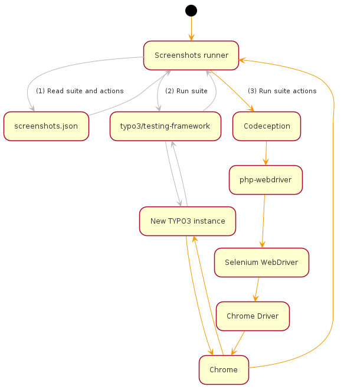
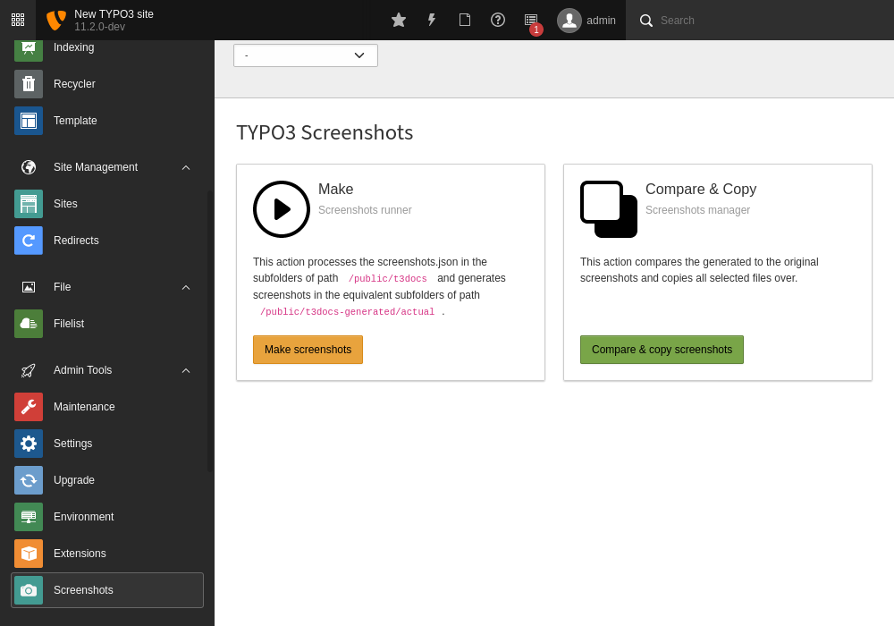
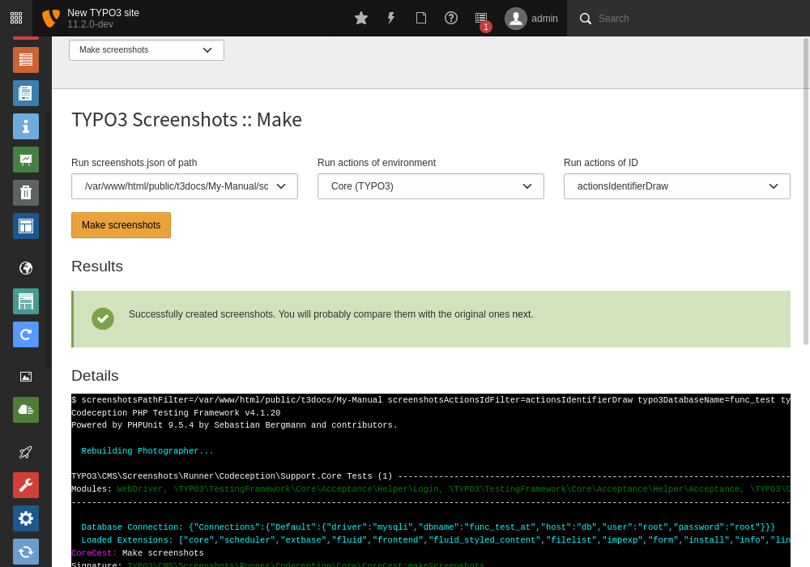
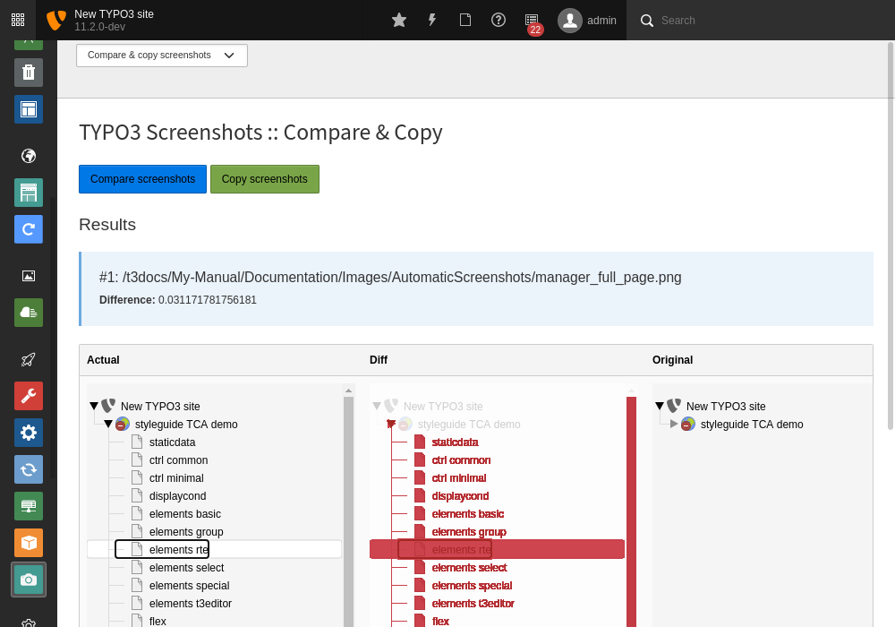
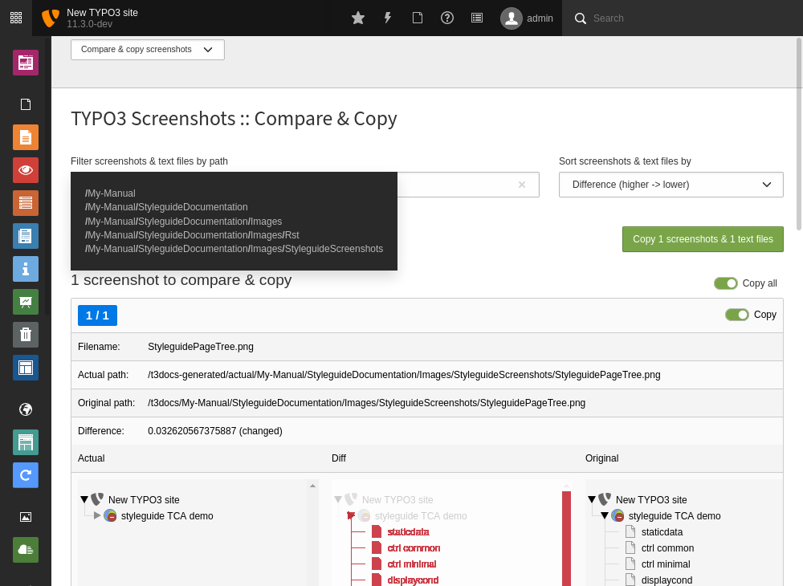
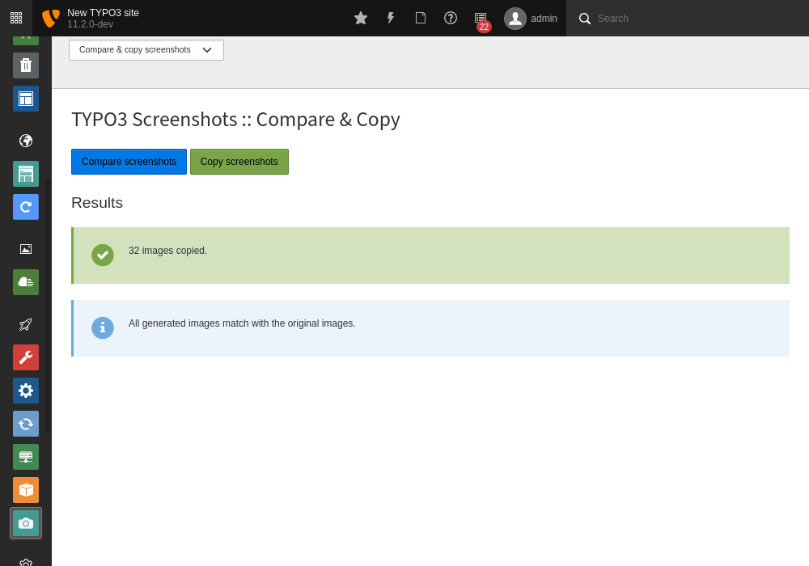

|BadgeTestingStatus| |BadgeCodeCoverage|

.. |BadgeTestingStatus| image:: https://github.com/TYPO3-Documentation/t3docs-screenshots/actions/workflows/tests.yml/badge.svg
   :alt: Testing Status

.. |BadgeCodeCoverage| image:: https://byob.yarr.is/TYPO3-Documentation/t3docs-screenshots/code-coverage
   :alt: Code Coverage

=================
TYPO3 Screenshots
=================

This project provides a way to take screenshots of the TYPO3 CMS in a scripted way.

First, the user browses TYPO3 instances to take notes of a click path for a new screenshot.
Next, the click path gets forged to a ``screenshots.json`` file.
Then, all ``screenshots.json`` files get executed by the screenshots runner which produces the screenshots.
Last, the user compares the actual screenshots to the original screenshots in the screenshots manager and copies over if
approved.

In order to provide a wide range of screenshots, this project comes with a set of pre-configured TYPO3 environments with
initialized page trees, so-called *suites*. Each TYPO3 instance of a suite can be accessed at a specific URL and
configured for use by the screenshot runner in the ``screenshots.json` file.

Activity of the screenshots runner:

.. contents:: Table of Contents

Prerequisites
=============

Install

1.  `Docker <https://docs.docker.com/get-docker/>`_
2.  `Docker-Compose <https://docs.docker.com/compose/install/>`_
3.  `DDEV <https://ddev.readthedocs.io/en/stable/>`_

.. _installation:

Installation
============

1. Install the project by

   .. code-block:: bash

      ddev install

2. Test the project by

   a. creating a dummy ``screenshots.json`` with example entries at ``public/t3docs/My-Manual`` by

      .. code-block:: bash

         ddev init-screenshot-json -t My-Manual

   b. running the dummy ``screenshots.json`` by

      .. code-block:: bash

         ddev make-screenshots -t My-Manual

   c. approving your installation by confirming that the screenshots have been created in
      ``public/t3docs-generated/actual/My-Manual``.

Now you are ready to browse the suite TYPO3 instances, create custom ``screenshots.json`` files and generate screenshots
from them.

Maintenance
===========

Below is a list of common commands for handling the project.

Start
-----

Start the project by

.. code-block:: bash

   ddev start

Stop
----

Stop the project by

.. code-block:: bash

   ddev stop

Reinstallation
--------------

You might want to setup the project or a single suite TYPO3 instance from scratch to remove all temporary changes of it.
This can be reliably achieved by resetting the project with

.. code-block:: bash

   ddev install

or by resetting a single suite TYPO3 instance with

.. code-block:: bash

   ddev install -s [suite-id]

again. Available suite IDs are "core", "examples", "install", "introduction", "site-package" and "styleguide".

Synchronizing
-------------

Instead of re-installing the project or suite TYPO3 instance and lose all database changes, you might want to only
reflect updates of the project composer packages in your suites TYPO3 instances packages. Do this with

.. code-block:: bash

   ddev install --initialize-suites-only

or by reflecting to a single suite TYPO3 instance with

.. code-block:: bash

   ddev install --initialize-suites-only -s [suite-id]

Uninstallation
--------------

Remove the project by

.. code-block:: bash

   ddev delete -yO

.. _browsable-typo3-instances:

Browsable TYPO3 instances
=========================

1. Start the project - if not already present.
2. Navigate the browser to one or more of these URLs:

   -  Screenshots manager: https://t3docs-screenshots.ddev.site/typo3
   -  Suite "Core": https://core.t3docs-screenshots.ddev.site/typo3
   -  Suite "Examples": https://examples.t3docs-screenshots.ddev.site/typo3
   -  Suite "Install": https://install.t3docs-screenshots.ddev.site
   -  Suite "Introduction": https://introduction.t3docs-screenshots.ddev.site/typo3
   -  Suite "Site Package": https://site-package.t3docs-screenshots.ddev.site/typo3
   -  Suite "Styleguide": https://styleguide.t3docs-screenshots.ddev.site/typo3

3. Log in to the TYPO3 backend with credentials "admin" and "password".

Now you are ready to browse the suite TYPO3 backends and look up element selectors for use in actions of your
``screenshots.json``.

Screenshots runner
==================

The runner scans the sub folders of ``public/t3docs``, processes the ``public/t3docs/*/screenshots.json`` files and
creates the screenshots in ``public/t3docs-generated/actual/*/`` where they get further processed by the screenshots
manager. Please note that ``public/t3docs-generated/actual/*/`` is cleaned up before the run, so it does not contain
outdated screenshots.

Folders in ``public/t3docs``
----------------------------

The folders in ``public/t3docs`` should contain the official TYPO3 Documentation manuals or other documentation that
needs fresh screenshots of TYPO3. Get all official TYPO3 Documentation manuals in one bundle (requires access
permission) by

.. code-block:: bash

   ddev auth ssh
   ddev fetch-manuals

File ``screenshots.json``
-------------------------

The runner configuration file ``screenshots.json`` must be placed in the root directory of the respective documentation
folder, i.e. in ``public/t3docs/*/screenshots.json``. It defines in the first level the suite
("Core", "Examples", "Install", "Introduction", "SitePackage" or "Styleguide") where the screenshots are taken,
and in the second level it lists blocks of browser actions. Each action is an object, where the key ``action`` marks
the action name and the remaining keys represent the action parameters.
Actions are mainly about navigating the suite TYPO3 instance and taking screenshots.

Create a basic ``screenshots.json`` in an arbitrary manual folder at ``public/t3docs`` by

.. code-block:: bash

   ddev init-screenshot-json [-t folder]

where ``folder`` defaults to ``My-Manual`` if left blank.

This is a small runner configuration which takes screenshots of all available suites:

.. code-block:: json

   {
      "suites": {
         "Core": {
            "screenshots": [
               [
                  {"action": "makeScreenshotOfWindow", "fileName": "CoreDashboard"}
               ]
            ]
         },
         "Examples": {
            "screenshots": [
               [
                  {"action": "makeScreenshotOfFullPage", "fileName": "ExamplesDashboardFullPage"}
               ]
            ]
         },
         "Install": {
            "screenshots": [
               [
                  {"action": "makeScreenshotOfFullPage", "fileName": "InstallationFullPage"}
               ]
            ]
         },
         "Introduction": {
            "screenshots": [
               [
                  {"action": "makeScreenshotOfFullPage", "fileName": "IntroductionDashboardFullPage"}
               ]
            ]
         },
         "SitePackage": {
            "screenshots": [
               [
                  {"action": "makeScreenshotOfFullPage", "fileName": "SitePackageDashboardFullPage"}
               ]
            ]
         },
         "Styleguide": {
            "screenshots": [
               [
                  {"action": "makeScreenshotOfTable", "pid": 0, "table": "pages", "fileName": "StyleguideRootPage"}
               ],
               [
                  {"action": "makeScreenshotOfRecord", "table": "pages", "uid": 1, "fileName": "StyleguideFirstPageRecord"}
               ]
            ]
         }
      }
   }

Screenshots are mainly made by the actions ``makeScreenshotOfWindow``, ``makeScreenshotOfFullPage``,
``makeScreenshotOfContentFrame`` and ``makeScreenshotOfElement``, the first one taking a screenshot of the browser
window, the second one taking a screenshot of the whole TYPO3 page, the third one only of the TYPO3 backend content
frame and the last one of a specific DOM element, e.g.

.. code-block:: json

   {
       "suites": {
           "Core": {
               "screenshots": [
                   [
                       {"action": "see", "text": "List"},
                       {"action": "click", "link": "List"},
                       {"action": "waitForText", "text": "New TYPO3 site"},
                       {"action": "makeScreenshotOfWindow", "fileName": "Typo3Window"},
                       {"action": "makeScreenshotOfFullPage", "fileName": "Typo3FullPage"},
                       {"action": "makeScreenshotOfContentFrame", "fileName": "Typo3ContentFrameOnly"},
                       {"action": "makeScreenshotOfElement", "selector": ".topbar-header-site", "fileName": "Typo3ElementOnly"}
                   ]
               ]
           }
       }
   }

The captured screenshot might contain too much information that is not needed for the documentation. Therefore it can
be cropped for the purpose of the documentation - or the width of the documentation page - with ``cropScreenshot``,
e.g.

.. code-block:: json

   {
      "suites": {
         "Introduction": {
            "screenshots": [
               [
                    {"action": "makeScreenshotOfFullPage", "fileName": "IntroductionCropRightTop"},
                    {"action": "cropScreenshot", "fileName": "IntroductionCropRightTop", "position": "right-top", "height": 400, "width": 400},
               ]
            ]
         }
      }
   }

The target folder of the screenshots is ``Images/AutomaticScreenshots`` by default and is calculated
relative to the ``screenshots.json``. The path can be adapted by the actions ``setScreenshotsDocumentationPath`` and
``setScreenshotsImagePath`` respectively, e.g.

.. code-block:: json

   {
      "suites": {
         "Introduction": {
            "screenshots": [
               [
                  {"action": "setScreenshotsDocumentationPath", "path": "IntroductionDocumentation"},
                  {"action": "setScreenshotsImagePath", "path": "Images/IntroductionScreenshots"},
                  {"action": "makeScreenshotOfWindow", "fileName": "IntroductionDashboard"}
               ]
            ]
         }
      }
   }

which would result in a target folder ``IntroductionDocumentation/Images/IntroductionScreenshots``.

To steer the runner through the TYPO3 backend, many TYPO3 specific actions have been added to the general browser
navigation actions, e.g.

.. code-block:: json

   {
      "suites": {
         "Styleguide": {
            "screenshots": [
               [
                  {"action": "switchToMainFrame"},
                  {"action": "scrollModuleMenuTo", "toSelector": "#web_list"},
                  {"action": "click", "link": "List"},
                  {"action": "openPageTreePath", "path": ["styleguide TCA demo", "elements rte"]},
                  {"action": "scrollPageTreeTo", "toSelector": "#identifier-0_12"},
                  {"action": "switchToContentFrame"},
                  {"action": "waitForText", "text": "elements rte", "timeout": 5},
                  {"action": "scrollModuleBodyToBottom"},
                  {"action": "makeScreenshotOfWindow", "fileName": "StylesheetContentScrolledDown"},
               ]
            ]
         }
      }
   }

To guide the reader of the documentation over the screenshot, DOM elements can be highlighted by actions ``drawBox``,
``drawArrow``, ``drawBadge``, etc. and the highlighting can be removed later by action ``clearDrawings``, e.g.

.. code-block:: json

   {
      "suites": {
         "Introduction": {
            "screenshots": [
               [
                  {"action": "drawBox", "selector": "#dashboard"},
                  {"action": "drawArrow", "selector": "#dashboard", "position": "right-bottom"},
                  {"action": "drawBadge", "selector": "#dashboard", "label": "Click here", "position": "bottom"},
                  {"action": "makeScreenshotOfWindow", "fileName": "IntroductionDashboardWithHighlightedMenuitem"},
                  {"action": "clearDrawings"},
                  {"action": "makeScreenshotOfWindow", "fileName": "IntroductionDashboardWithoutHighlightedMenuitem"}
               ]
            ]
         }
      }
   }

Along with the screenshot a reStructuredText file gets created automatically in the folder ``Images/Rst``
and can be used to include the screenshot comfortably into a documentation. The path can be changed by the actions
``setScreenshotsDocumentationPath`` and ``setScreenshotsRstPath`` and the automatic creation can be switched via action
``createScreenshotsRstFile``, e.g.

.. code-block:: json

   {
      "suites": {
         "Introduction": {
            "screenshots": [
               [
                  {"action": "setScreenshotsDocumentationPath", "path": "IntroductionDocumentation"},
                  {"action": "setScreenshotsRstPath", "path": "Images/IntroductionRst"},
                  {"action": "makeScreenshotOfWindow", "fileName": "IntroductionDashboardWithRstFile"},
                  {"action": "createScreenshotsRstFile", "create": false},
                  {"action": "makeScreenshotOfWindow", "fileName": "IntroductionDashboardWithoutRstFile"}
               ]
            ]
         }
      }
   }

which would result in a target folder ``IntroductionDocumentation/Images/IntroductionRst`` for reStructuredText files.

Another redundant documentation job besides taking screenshots is to insert and update code snippets. With action
``createCodeSnippet`` a specific TYPO3 code source file gets transformed into a reStructuredText file for inclusion and
gets saved to folder ``CodeSnippets``. The folder can be changed by ``setScreenshotsDocumentationPath`` and
``setCodeSnippetsTargetPath``.
Furthermore there are dedicated actions like ``createJsonCodeSnippet``, ``createPhpArrayCodeSnippet``,
``createPhpClassCodeSnippet``, ``createXmlCodeSnippet`` or ``createYamlCodeSnippet`` to store only excerpts of code
files, e.g.

.. code-block:: json

   {
      "suites": {
         "Styleguide": {
            "screenshots": [
               [
                  {"action": "setScreenshotsDocumentationPath", "path": "StyleguideDocumentation"},
                  {"action": "setCodeSnippetsTargetPath", "path": "CodeSnippets/StyleguideCode"},
                  {"action": "createCodeSnippet", "sourceFile": "typo3/sysext/core/Configuration/TCA/be_groups.php", "targetFileName": "CoreBeGroups"},
                  {
                     "action": "createCodeSnippet",
                     "sourceFile": "typo3/sysext/core/Configuration/TCA/be_groups.php",
                     "targetFileName": "CoreBeGroupsWithHighlights",
                     "caption": "I am the caption",
                     "name": "i-am-the-target-name",
                     "showLineNumbers": true,
                     "lineStartNumber": 1,
                     "emphasizeLines": [5,6,7]
                  }
                  {"action": "createJsonCodeSnippet", "sourceFile": "typo3/sysext/core/composer.json", "fields": ["name", "support/source"], "targetFileName": "CoreComposerJsonDescription"},
                  {"action": "createPhpArrayCodeSnippet", "sourceFile": "typo3/sysext/core/Configuration/TCA/be_groups.php", "fields": ["types"], "targetFileName": "CoreBeGroupsTypes"},
                  {"action": "createPhpClassCodeSnippet", "class": "TYPO3\\CMS\\Core\\Cache\\Backend\\FileBackend", "members": ["frozen", "freeze"], "withComment": true, "targetFileName": "FileBackendFreezeWithComments"},
                  {"action": "createXmlCodeSnippet", "sourceFile": "typo3/sysext/form/Configuration/FlexForms/FormFramework.xml", "nodes": ["T3DataStructure/sheets/sDEF"], "targetFileName": "FormFrameworkXmlSheetSDef"},
                  {"action": "createYamlCodeSnippet", "sourceFile": "typo3/sysext/core/Configuration/Services.yaml", "fields": ["services/_defaults"], "targetFileName": "CoreServicesYamlDefaults"}
               ]
            ]
         }
      }
   }

which would result in a target folder ``StyleguideDocumentation/CodeSnippets/StyleguideCode`` for code snippets.

Actions can be nested to use the return value of the inner action by the outer, e.g.

.. code-block:: json

   {
      "suites": {
         "Styleguide": {
            "screenshots": [
               [
                  {
                     "action": "makeScreenshotOfTable",
                     "pid": {"action": "getUidByField", "table": "pages", "field": "title", "value": "elements rte"},
                     "table": "pages",
                     "fileName": "StyleguideRootPage"
                  }
               ]
            ]
         }
      }
   }

which executes the action ``getUidByField()`` and uses the return value for parameter ``pid`` of action
``makeScreenshotOfTable()``.

Comments can be inserted to facilitate maintenance work, e.g.

.. code-block:: json

   {
      "suites": {
         "Styleguide": {
            "screenshots": [
               [
                  {"comment": "************************************"},
                  {"comment": "Take screenshots of TYPO3 TCA table."},
                  {"comment": "************************************"},
                  {"action": "makeScreenshotOfTable", "pid": 27, "table": "pages", "fileName": "StyleguideRootPage"}
               ]
            ]
         }
      }
   }

Files can be created and deleted in the public path of TYPO3 by actions ``writeFileToTypo3PublicPath`` and
``deleteFileInTypo3PublicPath``, e.g. to bypass access restrictions of the TYPO3 installation process:

.. code-block:: json

   {
      "suites": {
         "Install": {
            "screenshots": [
               [
                  {"action": "deleteFileInTypo3PublicPath", "filePath": "FIRST_INSTALL"},
                  {"action": "reloadInstallationProcess"},
                  {"action": "makeScreenshotOfElement", "selector": ".typo3-install-content", "fileName": "InstallationStep0"},
                  {"action": "writeFileToTypo3PublicPath", "filePath": "FIRST_INSTALL"},
                  {"action": "reloadInstallationProcess"},
                  {"action": "makeScreenshotOfElement", "selector": ".typo3-install-content", "fileName": "InstallationStep1"}
               ]
            ]
         }
      }
   }

An action block can be included in another action block of the same suite by assigning a custom identifier to the former
and using that identifier in the latter with the ``include`` directive, e.g.

.. code-block:: json

   {
      "suites": {
         "Styleguide": {
            "screenshots": {
               "_default": [
                  {"action": "resizeWindow", "width": 1024, "height": 768}
               ],
               "list": [
                  {"include": "_default"},
                  {"action": "see", "text": "List"},
               ]
            }
         }
      }
   }

where the actions with ID "_default" are included and executed at the beginning of the action block with ID "list".

Action blocks will not be executed directly if their custom identifier starts with an underscore. Therefore it is useful
to use such underscore identifiers for action blocks that are intended for inclusion only.

Included blocks can themselves include other blocks.

Available actions
-----------------

As action all codeception actions are supported including the actions of the packages ``typo3/testing-framework`` and
``t3docs/screenshots``. All available actions get compiled into
``packages/screenshots/Classes/Runner/Codeception/Support/_generated/PhotographerActions.php`` - ready for lookup.

A new action should be added to the files of ``packages/screenshots/Classes/Runner/Codeception/Support/Helper`` and then be
compiled into the ``PhotographerActions.php`` by

.. code-block:: bash

   ddev exec vendor/bin/codecept build -c public/typo3conf/ext/screenshots/Classes/Runner/codeception.yml

Custom content elements
-----------------------

In this project, TYPO3 distributions are used to provide a variety of content elements that can be browsed via actions
and from which screenshots can be taken. If the documentation author misses a custom content element, even after
rechecking all included distributions, the author has to

1. determine the most suitable distribution for creating the custom element:

   -  `EXT:examples <https://github.com/TYPO3-Documentation/t3docs-examples>`_

      This distribution is owned by the TYPO3 Documentation Team and is the fallback if no other distribution is more
      suitable.

   -  `EXT:introduction <https://github.com/TYPO3-Documentation/introduction>`_

      This distribution is aimed at the TYPO3 community and serves in general as a showcase for TYPO3 and in particular
      as a showcase for the underlying ``EXT:bootstrap_package`` which integrates the Twitter Bootstrap content elements
      into TYPO3.

   -  `EXT:styleguide <https://github.com/TYPO3-Documentation/styleguide>`_

      This distribution is mainly used in the TYPO3 Core test environment. It generates a lot of content elements for
      acceptance tests.

2. create a new Git branch in that distribution folder (see subfolders of ``public/typo3conf/ext/``)
3. log into the suite TYPO3 instance which uses that distribution (see URLs in section "`Browsable TYPO3 Instances <browsable-typo3-instances_>`_")
4. create the new content element
5. export the page tree (see section
   "`Database Data <https://docs.typo3.org/m/typo3/reference-coreapi/master/en-us/ExtensionArchitecture/CreateNewDistribution/#database-data>`_"
   of the distribution tutorial)
6. overwrite the existing ``data.xml`` file and ``data.xml.files`` folder of the distribution folder by the export
7. commit and push the changes of the distribution folder, create a pull request from it and wait for merging by the
   TYPO3 Documentation Team.

Once the changes are merged, actions can be added to create the corresponding screenshot.

Make all screenshots
--------------------

.. code-block:: bash

   ddev make-screenshots

Make screenshots of specific folder only
----------------------------------------

A folder path can be specified to process only the ``screenshots.json`` of this particular folder and its subfolders.
The folder path can be defined as an absolute path or relative to ``public/t3docs``, e.g. this command executes
``public/t3docs/TYPO3CMS-Reference-TCA/Documentation/screenshots.json``.

.. code-block:: bash

   ddev make-screenshots -t TYPO3CMS-Reference-TCA

Make screenshots of TYPO3 installation process
----------------------------------------------

.. code-block:: bash

   ddev make-screenshots -s Install

Make screenshots of TYPO3 backend
---------------------------------

.. code-block:: bash

   ddev make-screenshots -s Core

Make screenshots of TYPO3 backend + EXT:examples
------------------------------------------------

.. code-block:: bash

   ddev make-screenshots -s Examples

Make screenshots of TYPO3 backend + EXT:introduction
----------------------------------------------------

.. code-block:: bash

   ddev make-screenshots -s Introduction

Make screenshots of TYPO3 backend + EXT:site_package
----------------------------------------------------

.. code-block:: bash

   ddev make-screenshots -s SitePackage

Make screenshots of TYPO3 backend + EXT:styleguide
--------------------------------------------------

.. code-block:: bash

   ddev make-screenshots -s Styleguide

Make screenshots of TYPO3 backend + EXT:introduction + Subset of actions
------------------------------------------------------------------------

A custom identifier can be assigned to an action block and then used to execute only that specific subset of actions.
However, action blocks cannot be executed if their custom identifier begins with an underscore, which is intended for
inclusion in other action blocks.

.. code-block:: json

   {
      "suites": {
         "Styleguide": {
            "screenshots": {
               "root-page": [
                  {"action": "makeScreenshotOfTable", "pid": 0, "table": "pages", "fileName": "StyleguideRootPage"}
               ],
               "first-page": [
                  {"action": "makeScreenshotOfRecord", "table": "pages", "uid": 1, "fileName": "StyleguideFirstPageRecord"}
               ]
            }
         }
      }
   }

.. code-block:: bash

   ddev make-screenshots -s Styleguide -a first-page

Screenshots manager
===================

To manage the created screenshots, the TYPO3 instance backend of the screenshots manager
(see URL in section "`Browsable TYPO3 Instances <browsable-typo3-instances_>`_") provides a module "Screenshots", which
can be found in the module menu under Admin Tools > Screenshots. It provides three functions: Starting the screenshot
runner, comparing actual and original screenshots and copying screenshots from the actual path to the original path.

Welcome
-------

On the welcome page you can select the action you want to perform:

- create screenshots by processing the available ``screenshots.json`` through the screenshots runner or
- compare new screenshots with the originals and copy the new screenshots

Make screenshots
----------------

On this page you automatically start the screenshots runner, which starts a subprocess on the command line.
The result is displayed on this page as soon as the runner is finished - which may take a while.

To comfortably work with a large number of ``screenhots.json`` and actions, the number of actions can be reduced by
using the filter at the top of the page: Only actions matching the path, suite ID and actions ID criteria will then be
executed.

Compare & copy screenshots
--------------------------

On this page you compare the newly created screenshots of the runner with the originals. Each list item shows the
current state on the left, the original state on the right and the difference map in the middle. At the top it shows
the difference as a number.

Each screenshot is selected for copying by default, but can be deselected individually and in the aggregation. The same
applies to text files such as the screenshot reST include files or the code snippets.

To work comfortably with a large number of files, the list of screenshots and text files can be reduced by entering
a path in the search field at the top of the page: Only files with a matching path will then be displayed. Regular
expressions are supported and automatic suggestion of available paths is enabled.

Optionally sort the list by criteria, such as difference, file name or file path.

When you have confirmed the changes, pressing the "Copy screenshots" button will copy the screenshots to the original
location.

Eventually, the original screenshots were updated and the changes can be committed and pushed.

Development
===========

Run unit tests by

.. code-block:: bash

   ddev run-unit-tests

Run unit tests with code coverage by

.. code-block:: bash

   ddev xdebug on
   ddev run-unit-tests -c
   ddev xdebug off
